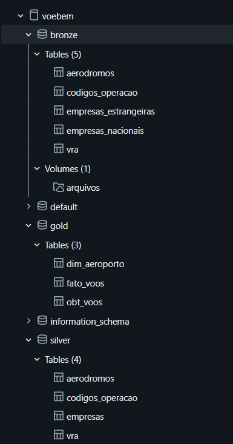

# VoeBem — Lakehouse de Pontualidade de Voos com Governança orientada a IA

Pipeline de dados end-to-end no Databricks, construído sobre os dados abertos de voos da ANAC (VRA — Voo Regular Ativo), com arquitetura medalhão (Bronze → Silver → Gold), pipeline de qualidade declarativo, governança de metadados pensada para consumo por IA (Genie) e um dashboard analítico de pontualidade.

> Projeto desenvolvido durante a imersão de Engenharia de Dados com IA (Alura).

## O problema

A ANAC publica mensalmente o VRA — todo voo regular operado no Brasil, com horário previsto e realizado de partida e chegada. É um dataset público, mas bruto: 12 arquivos CSV soltos, sem chave única, com armadilhas de encoding, cabeçalhos deslocados e cadastros de referência (empresas, aeródromos) fragmentados. O objetivo do projeto é transformar isso em uma base confiável de pontualidade — apta para BI tradicional **e** para ser consultada por um agente de IA sem alucinar.

## Arquitetura



| Camada | Regra | O que faz aqui |
|---|---|---|
| **Bronze** | Sem tipagem, sem filtro, sem união de fontes | Ingestão fiel do CSV: tudo `string`, nenhuma linha descartada, colunas de auditoria (`_arquivo_origem`, `_ingerido_em`) |
| **Silver** | Tipagem, união de cadastros do mesmo assunto, aritmética pura — nunca decisão de negócio | Espelho governado do bronze: mesma contagem de linhas, `TIMESTAMP`/`DATE` corretos, `atraso_partida_min`/`atraso_chegada_min`/`minutos_recuperados` calculados, 100% das colunas comentadas |
| **Gold** | Classificação, regra de negócio, agregação | `dim_aeroporto`, `fato_voos`, `obt_voos` — aplicam o limiar de pontualidade (15 min), classificam escopo doméstico/internacional, resolvem a quarentena registro a registro e alimentam dashboard e agente de IA |

Catálogo Unity Catalog: `voebem.bronze`, `voebem.silver`, `voebem.gold`. Detalhamento completo das decisões de negócio da camada Gold — incluindo o tratamento dado a cada uma das 213.543 linhas diagnosticadas pela quarentena — em `sql/gold.md`.

**Princípio central do projeto:** cada decisão de negócio embutida numa coluna (um limiar, uma classificação, um `WHERE`) fica na camada mais tardia possível. Um exemplo real documentado no notebook `09`: a métrica `minutos_recuperados` foi descrita erroneamente por uma IA generativa ("positivo = chegou adiantado") e a descrição só foi corrigida porque os dados foram consultados antes de aceitar o rascunho — 164.895 voos recuperaram minutos em voo e mesmo assim chegaram atrasados. Isso é o argumento prático de por que `COMMENT` em Unity Catalog deixou de ser documentação e virou requisito funcional quando o consumidor é um LLM.

## Estrutura do repositório

```
data-engineer-ai/
├── README.md                       # este arquivo
├── arquivos/
│   ├── arquivos.md                 # descrição das fontes de dados brutas
│   ├── referencias/                # cadastros ANAC (aeródromos, empresas)
│   └── vra/                        # 12 CSVs mensais do VRA (ago/2025–jul/2026)
├── assets/                         # imagens usadas na documentação
├── dashboard/
│   ├── dashboard.md                # descrição do dashboard de pontualidade
│   └── Pontualidade de Voos.lvdash.json
├── genie_agents/
│   └── perguntas.md                # perguntas de negócio validadas via Genie + SQL de referência
├── nootebook/                      # notebooks Databricks das camadas bronze e silver
│   ├── 03_bronze_vra.py
│   ├── 04_bronze_referencias.py
│   ├── 05_bronze_eda.py
│   ├── 06_silver_espelho.py.py
│   └── 09_governanca_gold.py.py
├── pipeline/
│   ├── 01_vra_marcado.sql          # contrato de dados — passo 1: flags de integridade referencial
│   ├── 02_vra_auditado.sql         # contrato de dados — passo 2: expectations (warn)
│   ├── 03_vra_quarentena.sql       # contrato de dados — passo 3: diagnóstico dos reprovados
│   └── pipeline_qualidade.md       # descrição do pipeline de qualidade
└── sql/                            # camada Gold — regras de negócio
    ├── 00_preparar_ambiente.sql    # bootstrap: catálogo, schemas, volume
    ├── 01_dim_aeroporto.sql        # dimensão de aeroporto (nasce do fato)
    ├── 02_fato_voos.sql            # fato: pontualidade, escopo, decisões de quarentena
    ├── 03_obt_voos.sql             # One Big Table para BI e IA
    └── gold.md                     # descrição da camada gold
```

## Stack técnica

- **Databricks**: PySpark, Delta Lake, Lakeflow Declarative Pipelines (Delta Live Tables) com `EXPECT` para contrato de dados, Unity Catalog (comentários e tags como metadado funcional)
- **Genie (IA conversacional do Databricks)**: EDA exploratória e geração assistida do dashboard, com perguntas de negócio validadas em `genie_agents/perguntas.md`
- **Lakeview**: dashboard de BI (`dashboard/Pontualidade de Voos.lvdash.json`)
- **Fonte de dados**: [Dados Abertos ANAC](https://sistemas.anac.gov.br/dadosabertos/) — VRA e cadastros de aeródromos e empresas aéreas

## Destaques de engenharia

1. **Bronze não filtra nunca** — decisão deliberada porque o VRA não tem chave natural única (o mesmo voo pode se repetir legitimamente no mesmo dia). Deduplicar no bronze seria aplicar regra de negócio na camada errada.
2. **Carga full refresh idempotente e atômica** via `overwrite` do Delta, preservando histórico via time travel — sem escrever uma linha de código de versionamento.
3. **Contrato de dados como código**: 9 expectations em modo `warn` na silver, que medem qualidade sem nunca descartar registro. A decisão de excluir é isolada na gold — camada de decisão de negócio.
4. **Quarentena como diagnóstico, não como filtro**: view materializada que espelha os registros reprovados com o motivo, nunca reduz a base publicada.
5. **Governança para consumo por IA**: 100% das colunas gold comentadas com significado de negócio (não tipo de dado) — e o processo incluiu revisão humana das descrições geradas por IA, com pelo menos um erro real corrigido e documentado.
6. **Quarentena resolvida por decisão explícita, não por regra genérica**: dos 213.543 registros diagnosticados com alguma reprovação de qualidade, cada categoria recebeu um julgamento de negócio documentado — mantidos 105.932 aeroportos fora do cadastro ANAC (são estrangeiros, não dado inválido), mantidos 30.800 voos sem horário previsto (métrica vira `NULL`, não zero), e removidos apenas 41 registros de duplicata exata.

