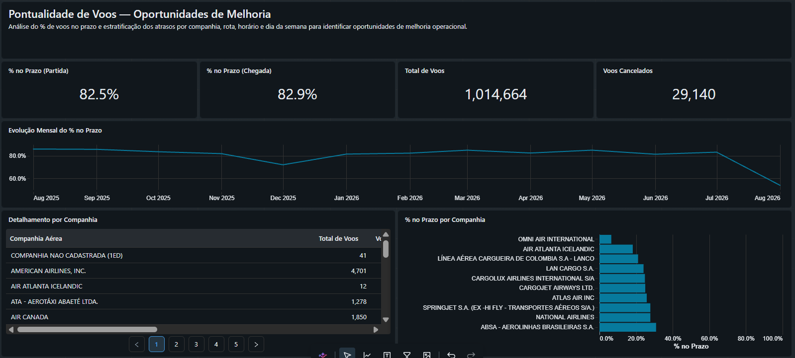
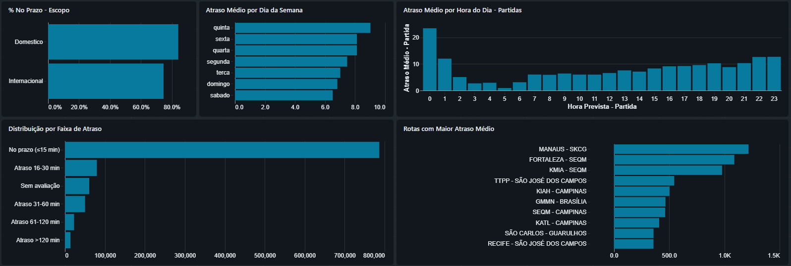

# Dashboard — Pontualidade de Voos

Dashboard Lakeview (`Pontualidade de Voos.lvdash.json`) construído sobre `voebem.gold.obt_voos` — a One Big Table gold é a única fonte de dados do dashboard, sem necessidade de join adicional.

## Como foi construído

Primeira versão gerada via prompt ao Genie (IA conversacional do Databricks):

> *"Com base na `obt_voos`, gere um dashboard trazendo o % de voos no prazo, e estratificando os voos em atraso, com objetivo de identificar oportunidades de melhoria."*

O resultado inicial teve *storytelling* e escolha de gráficos abaixo do esperado — foram feitos ajustes manuais depois para chegar à versão final documentada aqui. Human-in-the-loop (HITL): a IA acelera a primeira versão, o critério analítico humano decide o que fica.

## Estrutura: página "Visão Geral"

**KPIs (contadores):**

| Indicador | O que mostra |
|---|---|
| % no Prazo (Partida) | Percentual de voos com `partida_pontual = true` sobre o total com métrica válida |
| % no Prazo (Chegada) | Mesma lógica, para chegada |
| Total de Voos | Contagem geral no recorte do dashboard |
| Voos Cancelados | Contagem de `situacao_voo = 'CANCELADO'` |

**Gráficos analíticos:**

| Visual | Tipo | Pergunta que responde |
|---|---|---|
| % no Prazo por Companhia | Barras | Quais companhias entregam melhor pontualidade |
| Atraso Médio por Hora do Dia — Partidas | Barras | Existe efeito cascata de atraso ao longo do dia? |
| Evolução Mensal do % no Prazo | Linha | A pontualidade está melhorando ou piorando mês a mês? |
| Atraso Médio por Dia da Semana | Barras | Algum dia da semana concentra mais atraso? |
| Rotas com Maior Atraso Médio | Barras | Quais rotas específicas são o ponto crítico |
| Distribuição por Faixa de Atraso | Barras (pizza no rascunho original) | Como os voos atrasados se distribuem por faixas de atraso |
| % No Prazo — Escopo | Barras | Doméstico vs. internacional |
| Detalhamento por Companhia | Tabela | Visão tabular para drill-down manual |

## Perguntas de negócio validadas por trás do dashboard

As perguntas analíticas mais aprofundadas — recuperação de atraso em voo, diferença doméstico x internacional por aeroporto, pontualidade x cancelamento controlando por porte da companhia — foram validadas com SQL de referência direto sobre `obt_voos` antes de virarem visual, documentadas em `genie_agents/perguntas.md`. O dashboard consome a mesma tabela e a mesma lógica de negócio (limiar de 15 minutos, escopo, quarentena resolvida) usada nessas queries.
