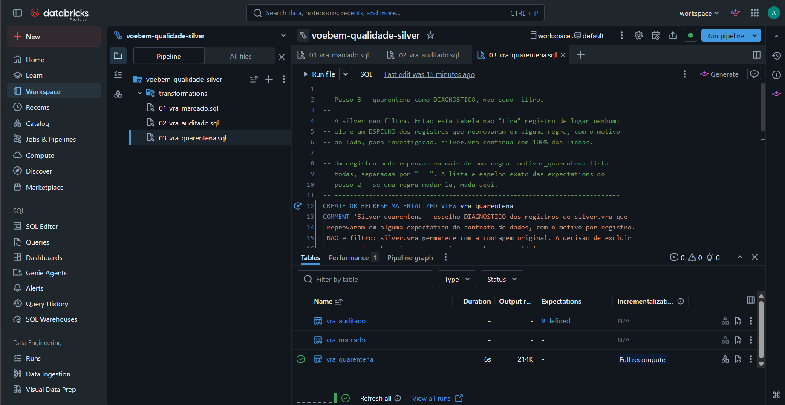

# Pipeline de qualidade — o contrato de dados como código

Três passos que medem a qualidade de `silver.vra` **sem nunca descartar uma linha**. A silver preserva 100% dos registros por princípio; é este pipeline que diagnostica o que está errado, e é a camada Gold (`fato_voos`, ver `sql/gold.md`) quem decide, registro a registro, o que fazer com cada motivo de reprovação.

## Passo 1 — `01_vra_marcado.sql`: sinalizar, não classificar

Cria a view temporária `vra_marcado`, que faz `LEFT JOIN` de `silver.vra` contra os cadastros de aeródromo e empresa e devolve três flags booleanas: `origem_no_cadastro`, `destino_no_cadastro`, `empresa_no_cadastro`.

Por que aqui e não como subquery direta na expectation: uma *expectation* do Lakeflow/Delta Live Tables não aceita subquery, e integridade referencial ("existe na outra tabela?") é por definição uma subquery. A saída é resolver o join **antes**, numa view intermediária, e deixar a expectation olhar só a flag.

Repare no que **não** existe aqui: nenhuma classificação de negócio (uma versão anterior deste script chegou a criar `escopo_origem`/`escopo_destino` pelo prefixo ICAO — isso foi removido porque é decisão de modelagem, e o lugar dela é a Gold).

## Passo 2 — `02_vra_auditado.sql`: o contrato, escrito como código

`LIVE VIEW vra_auditado`, com **nove `CONSTRAINT ... EXPECT`**, todas em modo `warn` (nenhuma tem `ON VIOLATION`). Isso é arquitetura: a silver não pode perder registro — as expectations **medem** a qualidade e publicam a métrica no event log, mas a linha continua viva. Quem decide excluir é a gold, porque excluir é decisão de negócio.

As nove regras, agrupadas:

- **Completude**: horários previstos presentes; situação do voo conhecida (`REALIZADO`/`CANCELADO`)
- **Coerência temporal**: chegada prevista depois da partida prevista; chegada real depois da partida real
- **Faixa plausível**: atraso de partida e de chegada entre −120 e 1440 minutos
- **Integridade referencial**: empresa, aeroporto de origem e aeroporto de destino no cadastro ANAC (usa as flags do passo 1)

Detalhe que evita um erro sutil de métrica: numa expectation, `NULL` conta como **reprovado**. As regras que podem receber `NULL` legitimamente (voo cancelado não tem horário real) escrevem esse `NULL` como aprovado, explicitamente — sem isso, duas regras diferentes acabam medindo a mesma coisa e o relatório mostra, por exemplo, 30 mil voos com "chegada antes da partida" que na verdade não existem.

## Passo 3 — `03_vra_quarentena.sql`: diagnóstico, não filtro

`MATERIALIZED VIEW vra_quarentena` espelha **apenas** os registros que reprovaram em alguma regra do passo 2, com a coluna `motivos_quarentena` listando todos os motivos (um registro pode reprovar em mais de uma regra, separados por `|`) e `_quarentenado_em` com o timestamp do diagnóstico.

Esta tabela não "tira" registro de lugar nenhum — `silver.vra` continua com 100% das linhas. É um espelho de investigação. A lista de motivos é sincronizada manualmente com as expectations do passo 2 (se uma regra muda lá, precisa mudar aqui).

No projeto, esse diagnóstico identificou **213.543 registros** com algum tipo de reprovação — o detalhamento categoria a categoria e a decisão tomada para cada uma (manter, anular métrica ou remover) estão documentados em `sql/gold.md`, junto com a construção de `fato_voos`.

## Por que este desenho

| | Silver | Pipeline de qualidade | Gold |
|---|---|---|---|
| Descarta linha? | Nunca | Nunca — só diagnostica | Sim, quando a decisão de negócio manda |
| Aplica limiar/regra de negócio? | Não | Não — só mede contra o contrato | Sim |
| Resultado | Espelho governado, mesma contagem do bronze | Métrica de qualidade + tabela de investigação | `fato_voos` / `obt_voos`, prontas para BI e IA |

A separação entre "medir" (pipeline de qualidade) e "decidir" (gold) é o que permite mudar uma decisão de negócio — por exemplo, tratar diferente um voo sem horário previsto — sem reprocessar a base inteira: muda uma linha de SQL na gold, o pipeline de qualidade e a silver não são tocados.
